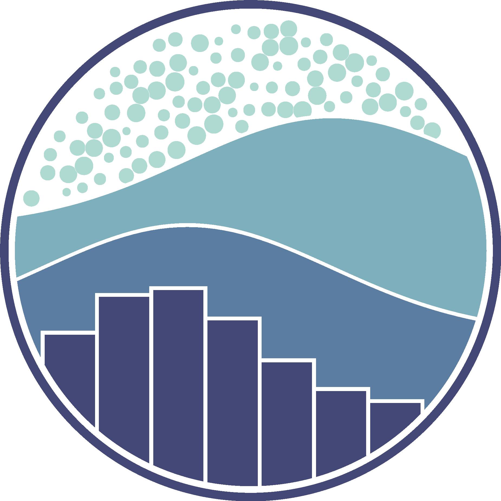

# Hi My name is Arindam Sahoo

  
  
  
  
  

## About Me

I am a Computer Engineering Enthusiast, seeking to utilize my programming knowledge to innovate and gain knowledge and experience in the process. I originated from Kolkata, West Bengal, India. I have been coding since 2010 and teaching coding since 2016 and I have been a corporate coding instructor since 2021. I have also worked as a Technical Content Creator and Reviewer.

* 🗺️  I'm based in The City of Joy - Kolkata
* 💼  I'm currently working at Juspay Hyperswitch
* 🌍  [Click Here](https://arindam-sahoo.netlify.app/) to see my portfolio
 

## My Github Badges

## My Stack
<h4 align="center">Programming Languages</h4>

    

<h4 align="center">AI & ML Tools and Technologies</h4>

  
  
  
  
  
  
  
  
  

<h4 align="center">Web Development Frameworks</h4>

    

<h4 align="center">Development Tools</h4>

    

<h4 align="center">Databases</h4>

    

<h4 align="center">Testing and Monitoring Tools</h4>

    

<h4 align="center">Others</h4>

  
  
  
  

## My Github Stats

  
    
   

## Other Repositories

